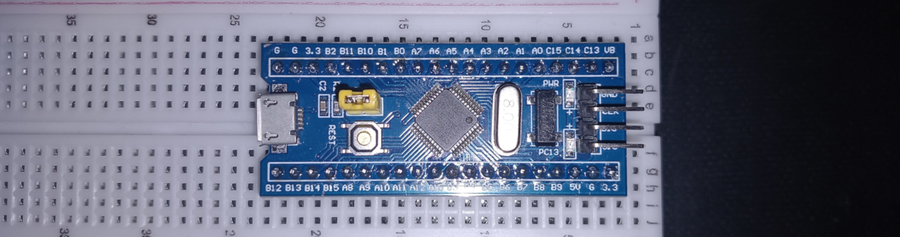

Model: STM32F030C8T6

Example projects for the STM32 "Blue Pill".

## Usage

You can run `make` inside each project to build the binary. To load
it, you can either use the st-link with:

```
make flash-link
```

Or via UART connection if you don't have the st-link. For this, you
will need an UART-to-USB connector such as the FT232RL. You will then
need to connect it to the UART1 ports which are P9 (stm32's TX) and
P10 (stm32's RX). Then when you want to load the binary you will need
to perform the following operation:

- remove the cap from the BOOT0 / BOOT1 yello pins
- click the reset button in the board
- run `make flash-uart`
- click the reset button again
