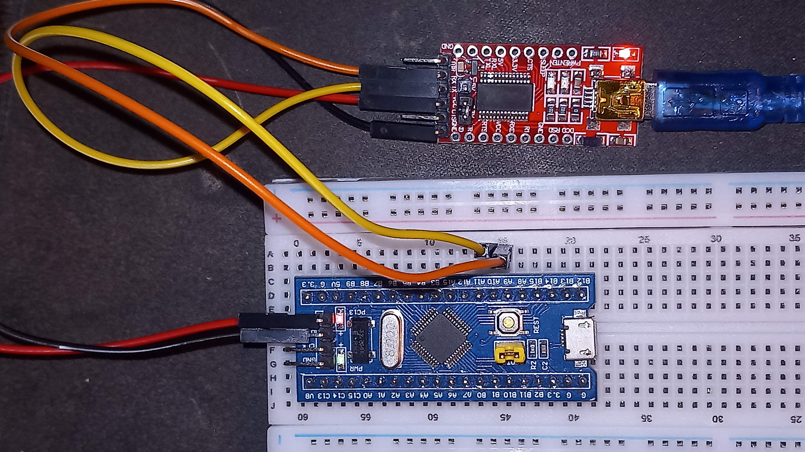

Model: STM32F030C8T6

Example projects for the STM32 "Blue Pill".

## Dependencies

```bash
sudo apt install gcc-arm-none-eabi stm32flash
```

## Usage

You can run `make` inside each project to build the binary. To load it, you can
either use the st-link with:

```bash
make flash-link
```

Or via UART connection if you don't have the st-link. For this, you will need an
UART-to-USB connector such as the FT232RL. You will then need to connect it to
the UART1 ports in the STM32 which are A9 (TX) and A10 (RX). Then when you want
to load the binary you will need to perform the following operation:

- remove the cap from the BOOT0 / BOOT1 yellow pins
- click the reset button in the board
- run `make flash-uart`
- click the reset button again
- put the cap back on

If you get `/dev/ttyUSB0: Permission denied` when you are accessing the tty, you
can check if the file is owned by a group and add yourself there:

```bash
sudo usermod -aG dialout $USER
```

You can also power the microcontroller via the UART-to-USB connector, but be
careful to use 3.3V. The setup would look like this:


